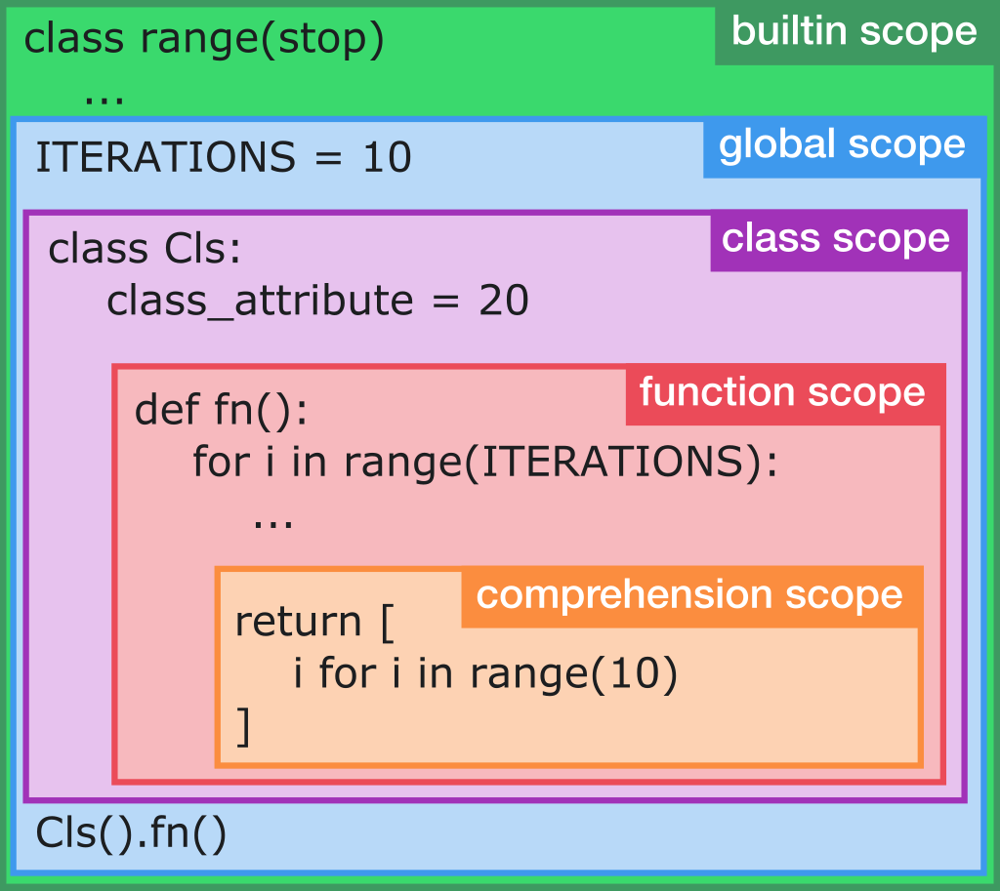

.. _libcst-metadata:

========
Metadata
========

-------------
Metadata APIs
-------------

LibCST ships with a metadata interface that defines a standardized way to
associate nodes in a CST with arbitrary metadata while maintaining the immutability
of the tree. The metadata interface is designed to be declarative and type safe.
Here's a quick example of using the metadata interface to get line and column
numbers of nodes through the :class:`~libcst.metadata.PositionProvider`:

.. _libcst-metadata-position-example:
.. code-block:: python

    class NamePrinter(cst.CSTVisitor):
        METADATA_DEPENDENCIES = (cst.metadata.PositionProvider,)

        def visit_Name(self, node: cst.Name) -> None:
            pos = self.get_metadata(cst.metadata.PositionProvider, node).start
            print(f"{node.value} found at line {pos.line}, column {pos.column}")

    wrapper = cst.metadata.MetadataWrapper(cst.parse_module("x = 1"))
    result = wrapper.visit(NamePrinter())  # should print "x found at line 1, column 0"

More examples of using the metadata interface can be found on the
:doc:`Metadata Tutorial <metadata_tutorial>`.

Accessing Metadata
------------------

To work with metadata you need to wrap a module with a :class:`~libcst.metadata.MetadataWrapper`.
The wrapper provides a :func:`~libcst.metadata.MetadataWrapper.resolve` function and a
:func:`~libcst.metadata.MetadataWrapper.resolve_many` function to generate metadata.

.. autoclass:: libcst.metadata.MetadataWrapper
   :special-members: __init__

If you're working with visitors, which extend :class:`~libcst.MetadataDependent`,
metadata dependencies will be automatically computed when visited by a
:class:`~libcst.metadata.MetadataWrapper` and are accessible through
:func:`~libcst.MetadataDependent.get_metadata`

.. autoclass:: libcst.MetadataDependent

Providing Metadata
------------------

Metadata is generated through provider classes that can be be passed to
:meth:`MetadataWrapper.resolve() <libcst.metadata.MetadataWrapper.resolve>` or
declared as a dependency of a :class:`~libcst.metadata.MetadataDependent`. These
providers are then resolved automatically using methods provided by
:class:`~libcst.metadata.MetadataWrapper`.

In most cases, you should extend
:class:`~libcst.metadata.BatchableMetadataProvider` when writing a provider,
unless you have a particular reason to not to use a batchable visitor. Only
extend from :class:`~libcst.metadata.BaseMetadataProvider` if your provider does
not use the visitor pattern for computing metadata for a tree.

.. autoclass:: libcst.BaseMetadataProvider
.. autoclass:: libcst.metadata.BatchableMetadataProvider
.. autoclass:: libcst.metadata.VisitorMetadataProvider

.. _libcst-metadata-position:

------------------
Metadata Providers
------------------
:class:`~libcst.metadata.PositionProvider`,
:class:`~libcst.metadata.ByteSpanPositionProvider`,
:class:`~libcst.metadata.WhitespaceInclusivePositionProvider`,
:class:`~libcst.metadata.ExpressionContextProvider`,
:class:`~libcst.metadata.ScopeProvider`,
:class:`~libcst.metadata.QualifiedNameProvider`,
:class:`~libcst.metadata.ParentNodeProvider`, and
:class:`~libcst.metadata.TypeInferenceProvider`
are currently provided. Each metadata provider may has its own custom data structure.

Position Metadata
-----------------
There are two types of position metadata available. They both track the same
position concept, but differ in terms of representation. One represents
position with line and column numbers, while the other outputs byte offset and
length pairs.

Line and column numbers are available through the metadata interface by
declaring one of :class:`~libcst.metadata.PositionProvider` or
:class:`~libcst.metadata.WhitespaceInclusivePositionProvider`. For
most cases, :class:`~libcst.metadata.PositionProvider` is what you probably
want.

Node positions are represented with :class:`~libcst.metadata.CodeRange`
objects. See :ref:`the above example<libcst-metadata-position-example>`.

.. autoclass:: libcst.metadata.PositionProvider
.. autoclass:: libcst.metadata.WhitespaceInclusivePositionProvider

.. autoclass:: libcst.metadata.CodeRange
.. autoclass:: libcst.metadata.CodePosition

Byte offset and length pairs can be accessed using
:class:`~libcst.metadata.ByteSpanPositionProvider`. This provider represents
positions using :class:`~libcst.metadata.CodeSpan`, which will contain the
byte offsets of a :class:`~libcst.CSTNode` from the start of the file, and
its length (also in bytes).

.. autoclass:: libcst.metadata.ByteSpanPositionProvider

.. autoclass:: libcst.metadata.CodeSpan

Expression Context Metadata
---------------------------
.. autoclass:: libcst.metadata.ExpressionContextProvider
   :no-undoc-members:

.. autoclass:: libcst.metadata.ExpressionContext

.. _libcst-scope-metadata:

Scope Metadata
--------------
Scopes contain and separate variables from each other. Scopes enforce that a
local variable name bound inside of a function is not available outside of that
function.

While many programming languages are "block-scoped", Python is
`function-scoped <https://en.wikipedia.org/wiki/Scope_(computer_science)#Function_scope>`_.
New scopes are created for classes, functions, and comprehensions. Other block
constructs like conditional statements, loops, and try…except don't create their
own scope.

There are five different types of scopes in Python:
:class:`~libcst.metadata.BuiltinScope`,
:class:`~libcst.metadata.GlobalScope`,
:class:`~libcst.metadata.ClassScope`,
:class:`~libcst.metadata.FunctionScope`, and
:class:`~libcst.metadata.ComprehensionScope`.

LibCST allows you to inspect these scopes to see what local variables are
assigned or accessed within.

.. note::
   Import statements bring new symbols into scope that are declared in other files.
   As such, they are represented by :class:`~libcst.metadata.Assignment` for scope
   analysis purposes. Dotted imports (e.g. ``import a.b.c``) generate multiple
   :class:`~libcst.metadata.Assignment` objects — one for each module. When analyzing
   references, only the most specific access is recorded.
   
   For example, the above ``import a.b.c`` statement generates three
   :class:`~libcst.metadata.Assignment` objects: one for ``a``, one for ``a.b``, and
   one for ``a.b.c``. A reference for ``a.b.c`` records an access only for the last
   assignment, while a reference for ``a.d`` only records an access for the
   :class:`~libcst.metadata.Assignment` representing ``a``.

.. autoclass:: libcst.metadata.ScopeProvider
   :no-undoc-members:

.. autoclass:: libcst.metadata.BaseAssignment
   :no-undoc-members:

.. autoclass:: libcst.metadata.Access
.. autoclass:: libcst.metadata.Assignment
.. autoclass:: libcst.metadata.BuiltinAssignment

.. autoclass:: libcst.metadata.Scope
   :no-undoc-members:
   :special-members: __contains__, __getitem__, __iter__

.. autoclass:: libcst.metadata.BuiltinScope
   :no-undoc-members:

.. autoclass:: libcst.metadata.GlobalScope
   :no-undoc-members:

.. autoclass:: libcst.metadata.FunctionScope
.. autoclass:: libcst.metadata.ClassScope
.. autoclass:: libcst.metadata.ComprehensionScope

.. autoclass:: libcst.metadata.Assignments
   :special-members: __contains__, __getitem__, __iter__

.. autoclass:: libcst.metadata.Accesses
   :special-members: __contains__, __getitem__, __iter__

Qualified Name Metadata
-----------------------
Qualified name provides an unambiguous name to locate the definition of variable and it's
introduced for class and function in `PEP-3155 <https://www.python.org/dev/peps/pep-3155/>`_.
QualifiedNameProvider provides possible :class:`~libcst.metadata.QualifiedName` given a
:class:`~libcst.CSTNode`.

We don't call it `fully qualified name <https://en.wikipedia.org/wiki/Fully_qualified_name>`_
because the name refers to the current module which doesn't consider the hierarchy of
code repository.

For fully qualified names, there's :class:`~libcst.metadata.FullyQualifiedNameProvider`
which is similar to the above but takes the current module's location (relative to some
python root folder, usually the repository's root) into account.

.. autoclass:: libcst.metadata.QualifiedNameSource
.. autoclass:: libcst.metadata.QualifiedName
.. autoclass:: libcst.metadata.QualifiedNameProvider
   :no-undoc-members:
   
.. autoclass:: libcst.metadata.FullyQualifiedNameProvider
   :no-undoc-members:

Parent Node Metadata
--------------------
A :class:`~libcst.CSTNode` only has attributes link to its child nodes and thus only top-down
tree traversal is doable. Sometimes user may want to access the parent :class:`~libcst.CSTNode`
for more information or traverse in bottom-up manner.
We provide :class:`~libcst.metadata.ParentNodeProvider` for those use cases.

.. autoclass:: libcst.metadata.ParentNodeProvider
   :no-undoc-members:

File Path Metadata
------------------
This provides the absolute file path on disk for any module being visited.
Requires an active :class:`~libcst.metadata.FullRepoManager` when using this provider.

.. autoclass:: libcst.metadata.FilePathProvider
   :no-undoc-members:

Type Inference Metadata
-----------------------
`Type inference <https://en.wikipedia.org/wiki/Type_inference>`__ is to automatically infer
data types of expression for deeper understanding source code.
In Python, type checkers like `Mypy <https://github.com/python/mypy>`_ or
`Pyre <https://pyre-check.org/>`__ analyze `type annotations <https://docs.python.org/3/library/typing.html>`__
and infer types for expressions.
:class:`~libcst.metadata.TypeInferenceProvider` is provided by `Pyre Query API <https://pyre-check.org/docs/querying-pyre.html>`__
which requires `setup watchman <https://pyre-check.org/docs/getting-started/>`_ for incremental typechecking.
:class:`~libcst.metadata.FullRepoManager` is built for manage the inter process communication to Pyre.

.. autoclass:: libcst.metadata.TypeInferenceProvider
   :no-undoc-members:

.. autoclass:: libcst.metadata.FullRepoManager
   :no-undoc-members:
   :special-members: __init__
